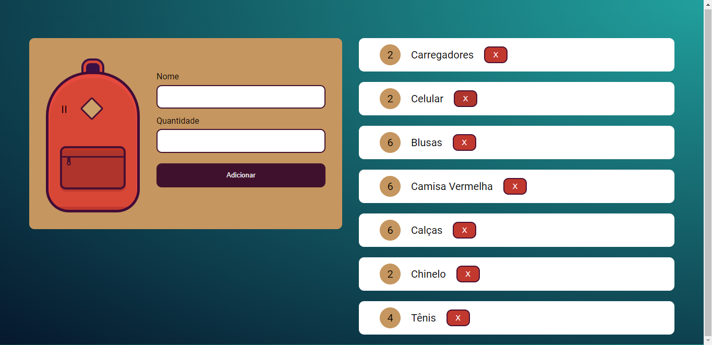

# Mochila de Viagem

One course provided by **Alura**, which has **Pedro Marins** as an instructor: 
[Click here to access](https://cursos.alura.com.br/course/javascript-web-armazenando-dados-navegador)

# Site Preview

# Course Concept 

Here the student of Alura will conclude the "Mochila de Viagem" project. He will create the system that will register the user's
equipment and the quantity that he wants to bring on his road trip.

# Major Knowledges 

- Creating dynamic elements with Js
- Practice DOM manipulation 
- How to manipulate the Local Storage
